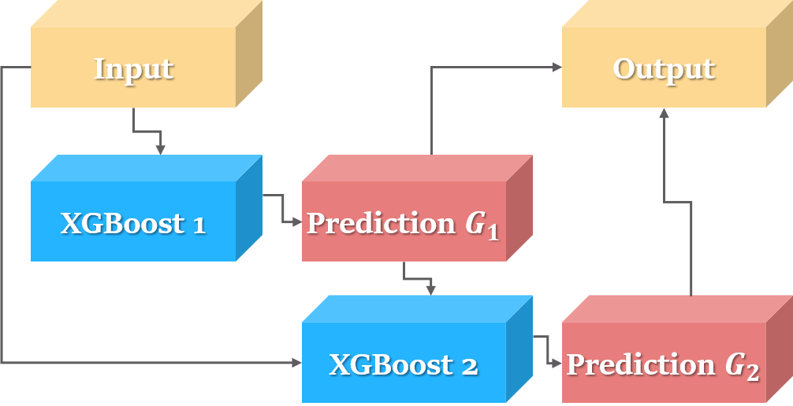
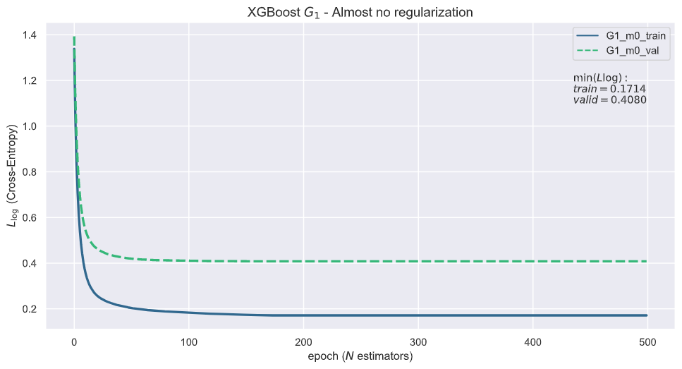
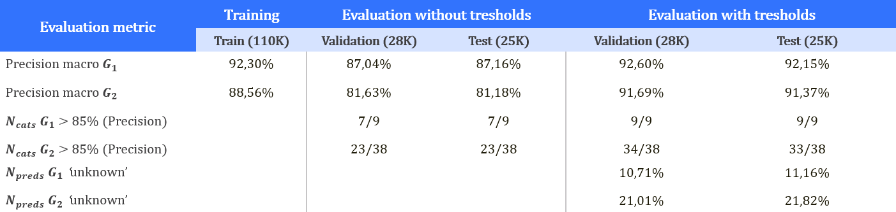
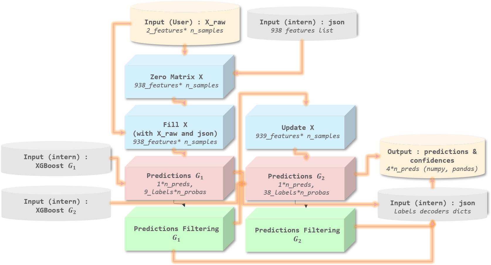
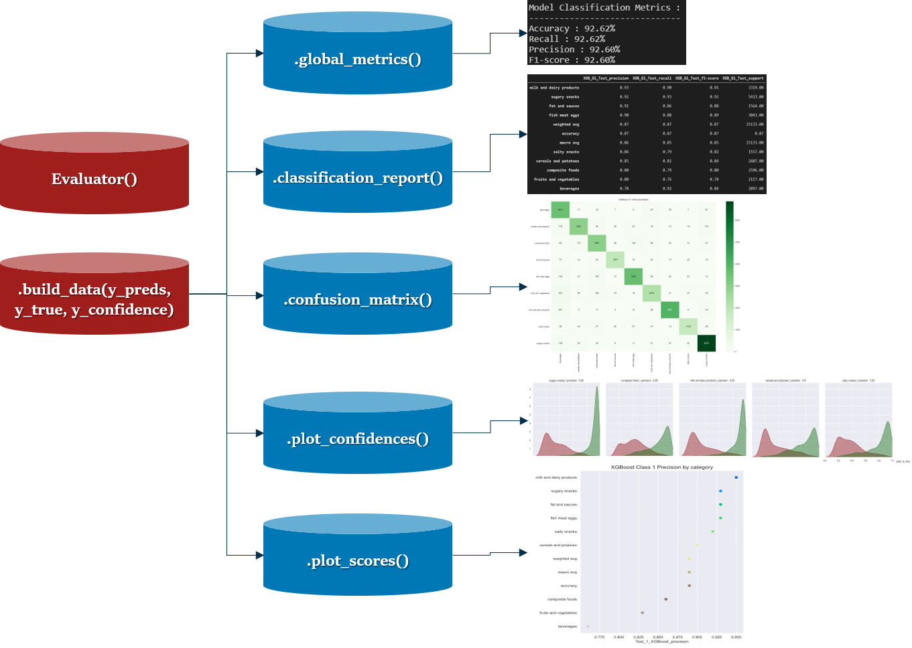
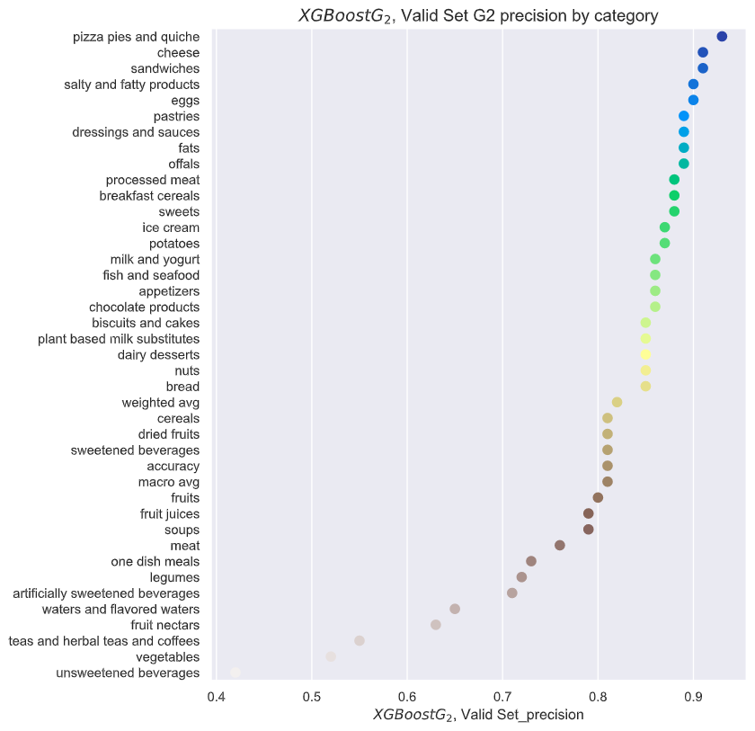
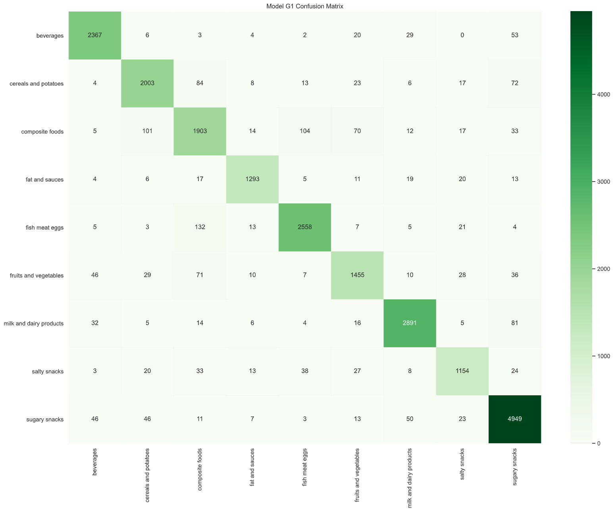
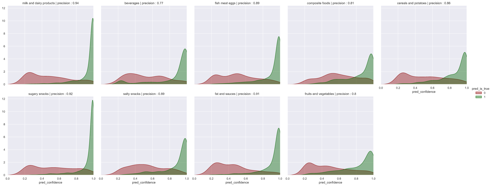

# Mutli-label multi-class classification of foodstuffs products with Open Food Facts data

> **Note** : This readme present a summary of the project with key insights and the final reusable models. 
> If you want to access only the documentation for model and evaluation classes, click here. 

## Table of contents :

* [Repo Summary](repo_summary)
* [Context & Data](context)
* [Machine Learning Modeling](ml_models)
* [Results](results)
* [XGFood (Final model class)](xgfood)
* [Evaluator (Evaluation Class)](eval)
* [Limitations, possible areas for improvements & future work](limits)

## <a name="repo_summary"> </a> Repo content summary
 
 * [EDA_and_Preprocessing](EDA_and_Preprocessing) : Notebooks `.ipynb` with features & labels preprocessing
 * [ML Models](ML%20Models) : Notebooks `.ipynb` with model selection & evaluation
 * [food_model](food_model) : Python scripts `.py` with models & evaluation class :
    * [XG Food](food_model/xgfood.py) (Class with the full final model process, from preprocessing to filtering)
    * [Evaluator](food_model/evaluator.py) (Class used to plot graphs & metrics for model evaluation)
    * [Files](food_model/files) (Files reference for xgfood)

## <a name="context"> </a> Context & data

### Context

Labeling is a time-consuming and expensive task, but is needed for many applications. More than 50% of Open Food Facts products are unlabelled,
which make some useful and interesting applications more difficult or impossible (statistics, research, scores calculation -nutri score for example-, etc).
  
The Open Food Facts database was, At the time of this project, composed by appr. 1.7 millions products and 185 columns with various informations and filled percentage.

Our goal was to predict a "high-level" category of products with this database. We have 2 labels to predict : 
  * The first group (often denoted as *G1* or pnns_groups_1), composed of 9 unique labels (can be beverages, salty snacks, etc)
  * The second group (oftend denoted as *G2* or pnns_groups_2), composed of 38 unique labels. **These are sub categories of group 1**.

Full list of labels members is accessible [here](food_model/files/labels_G1_code_reference.json) for group 1 
and [here](https://github.com/AntoineBONELLI/openfoodfacts-ai/blob/off_emlyon_ai/ai-emlyon/food_model/files/labels_G2_code_reference.json) for group 2.

### Dataset 

We decided to keep 2 features : `ingredients` and `product_name`. We then create a total of 938 new features, based on most frequent ingredients and words.
Our features engineering & preprocessing method give deployable results without using information that is less frequently completed by open food facts userd, like nutritional values.
However, our method has some limitations and could be largely improved : more on that at later.

Our unprocessed dataset is therefore composed with 167 548 products, 2 features and 2 targets :

  - `product_name` *(String)* : feature - name of product
  - `ingredients` *(Object)* :  feature - ingredients list in structured format (list of dicts)
  - `pnns_groups_1` *(Category)* : target - G1 Label (9 unique categories)
  - `pnns_groups_2` *(Category)* : target - G2 Label (38 unique categories)

We end up with features processing methods and get **938 features** (450 related to ingredients and 488 related to words).
We keep **110K products** for training, **28K for validation** and **25K for test**. Splits are stratified over G2 (38 labels).

<p>&nbsp;</p>

## <a name="ml_models"> </a> Machine Learning Modeling

### Short summary on tried approachs
***

We tried linear models and support vectors machines with dimensionality reduction (PCA), 
tree-based bagging and boosting methods (random forests, adaboost, xgboost) with different frameworks : One-vs-rest and chain or parallel models for multi-output for example.

Here is a short summary of scores (predicting *G1*) for models :

| (Pipeline) - Model	 | Best macro precision	| Notes |
|:--------|----------------------:|:--------------------|
| Random Forest | 85.45%           | Tested with 2K trees or small forest in one-vs-rest |
| (PCA) - Logistic Regression | 69.31%     | Tested with Lasso, Ridge and Elastic-net penalties |
| (PCA) - Support Vectors Machines| 69.77% | Tested with various C (range 0.5, 3) and RBF kernel |
| Adaboost | 83.11% | Tested with Decision Tree for base estimator |
| XGBoost | 85.79% | Used cart gradient boosted trees with hist. method |

### Chosen model & architecture
***

We finally opted for a chain classification with XGBoost to predict multiple labels :

<p>&nbsp;</p>



We first train a model to predict G1 (9 labels), append the prediction to the features matrix X and finally fit a model to predict G2.

<p>&nbsp;</p>

### Training & Testing Framework
***

We used the following method to train, optimize and evaluate our models :  

<p>&nbsp;</p>


<p>&nbsp;</p>

We defined tresholds to replace predictions with a low level of confidence by 'unknown' 
to increase the precision and get a deployable model but keep most of the original predictions (at least 80%).

Tresholds definition is based on probabilities distribution per label 
on the validation dataset with a `hue=pred_is_true` (`green` if pred is true, `red` else) :

* [G1 KDEs plots per category](images/xgb_G1_valid_conf.png)

* [G2 KDEs plots per category](images/confidence_xg2.png)

<p>&nbsp;</p>

### Regularization
***

We used Cross-Entropy as evaluation metric. The loss path for the first label (G1) with no regularization is the following :



<p>&nbsp;</p>

When we control the complexity, we obtain closer train & valid error paths : 


<p>&nbsp;</p>

### Final parameters 
***

Final tuned parameters used to build our model for the G1 :

```python
model = XGBClassifier(
    #----Fixed parameters----
    booster='gbtree', #gradient boosted tree
    tree_method='hist', #hist method
    eval_metric='mlogloss', #cross entropy
    
    #----Control train path----
    n_estimators=750, #n epochs
    learning_rate=0.15, #not too small lr
    
    #----Control data fitting----
    colsample_bylevel=0.9, #features
    colsample_bynode=0.9, #features
    colsample_bytree=0.3, #features
    subsample=0.8 #samples
    
    #----Control complexity----
    max_depth=40, #high max depth
    gamma=3, #loss complexity
    min_child_weight=1.5, #derivative of the loss
    reg_alpha=1, #L1 norm
    reg_lambda=1, #L2 norm
    )
eval_set = [(X_train, y_train_G1), (X_valid, y_valid_G1)]
model.fit(X_train, y_train_G1, eval_set=eval_set, early_stopping_rounds=50)
```

We use similar parameters then to fit a model to predict label 2 (G2).

<p>&nbsp;</p>

## <a name="results"> </a> Results

Our finals results, with metrics that matters to deploy the model are the following :



Where :
  - G1 is the first label prediction (9 unique labels) 
  - G2 the second label prediction (38 unique labels)
  - Precision macro is the macro average precision for all categories of the dedicated group (G1 or G2)
  - N_cats < 85% is the number of labels in a group for which the precisin is more than 85%
  - N_preds 'unknown' is, after tresholds filtering, the proportion of predictions that are changed to 'unknown'.

<p>&nbsp;</p>

#### Precision per category for G1 labels, with tresholds (11% dropped predictions) :


<p>&nbsp;</p>

#### Precision per category for G2 labels, with various tresholds (21% dropped predictions) :


<p>&nbsp;</p>

## <a name="xgfood"> </a> XGFood

You can use the final model with the class XGFood ([code here](food_model/xgfood.py)).

To try the model, the dataset with 167 548 labelled (`y_true`) and unprocessed products (`X_raw`) 
can be found [on this Google drive](https://drive.google.com/drive/folders/1yg8kT_MpYA2rKGDwiEJ2chs_UNnfq1IC).

Models files `.model` can be downloaded [here](https://drive.google.com/drive/folders/1LyuYedAdya_lGW5fowTtKw8hr1FZhmRh?usp=sharing).

Finally, you can download the small folder [with json files](food_model/xgfood.py).

>**Put the `.model` files in the files folder, and the files folder in the same folder that `xgfood.py` before run the model. 
>Otherwise, you will not be able to load every dependent files.

After loaded the dataset, you can load models by instantiating the XGFood class : 

```python
import xgfood.XGFood
model = XGFood()
```

And then use the predict method : 

```python
model.predict(X_raw)
```
By default, the output is a pandas `DataFrame` with 4 columns :

| y_pred_G1	 | y_conf_G1	| y_pred_G2  | y_conf_G2 |
|-----|-----|-----|-----|
| milk and dairy products | 0.90 | milk and yogurt | 0.93 |
| sugary snacks | 0.99 | sweets | 0.98 |
| composite foods | 0.67 | one dish meals | 0.98 |
| ... | ... | ... | ... |
| fruits and vegetables | 1.00 | fruits | 0.97 |

Where :

- `y_pred_G1` : predictions for group 1 (9 labels + 'y_unknown') 
- `y_pred_G2` : predictions for group 2 (38 labels + 'y_unknown') 
- if `get_confidences` set to `True` (default=`True`): 
    - `y_conf_G1` : level of confidence for G1 prediction
    - `y_conf_G2` : level of confidence for G2 prediction

You can change and get a *numpy `array`* format by passing `pred_format = 'np'` in the predict method :

```python
model.predict(X_raw, pred_format='np')
```

If you want, you can ask for only the predictions (without confidence levels) by setting `get_confidence = False` :

```python
model.predict(X_raw, get_confidence = False)
```

You can also set `preprocessed = False` if you want to preprocess X before with the `.process_X` method :

```python
X = model.process_X(X_raw)

predictions = model.predict(X, preprocess=False)
```

### Details on model class architecture

>This is the structure of `xgfood.py`

Given a X_raw, predictions are obtained with the following processus :



 1. Creation of a null `X` matrix *938_features, n_samples*, where *938* corresponds to the variables and N the number of products to be labeled
 2. Navigation in the `ingredients` column provided to fill the *450* variables relating to the ingredients with estimates on the percentage present of the ingredient for each product
 3. Navigation in the `product_name` column provided to fill the *488* variables relating to the text with 1 if the word is present.
 4. Send data to model 1 for Group 1 prediction
 5. Save predictions and probabilities
 6. Filter with thresholds defined by category (updated by 'y_unknown' if the confidence level is below the threshold)
 7. Update `X` with Group 1 prediction
 8. Sending updated data in model 2 for Group 2 prediction (38 unique labels)
 9. Save predictions and probabilities
 10. Filtering with thresholds defined by category (updated by 'y_unknown' if the confidence level is below the thresholds)
 11. Decode predicted labels
 12. Add predictions + confidence levels in a dataframe
 13. Output : array numpy or DataFrame pandas `[pred_G1, conf_G1, pred_G2, conf_G2],n_predictions`


## <a name="eval"> </a> Evaluator

The Evaluator class is dedicated to evaluate quickly model performances with basic but formated seaborn plot. We used mainly seaborn and matplotlib.
The class is composed of a method `build_data` dedicated to build the dataset used and then different simple plot & metrics methods.
Simple plots showed before in this documents are some examples.

You can access the code here
After downloaded `evaluator.py`, you can instantiate the class and build the dataset with your inputs :

```python
evaluation = Evaluator()

evaluation.build_data(y_true=y_true, y_pred=y_pred, y_confidence=y_conf)
```

Note that y_confidence is optional and default `None` (but required for the `.plot_confidence` method) :

```python
evaluation = Evaluator()

evaluation.build_data(y_true=y_true, y_pred=y_pred)
```

> List of available methods :




### Global Classification Metrics
```python
#Default arguments
Evaluator.global_metrics(average='weighted', name='Model')
```

Return Accuracy, Recall, Precision and F-1 score. Average can take `macro` or `weighted`

By default, the output start with a header `Model Classification Metrics` : 

```python
Evaluator.global_metrics()
```
```
Model Classification Metrics :
------------------------------
Accuracy : 85.10%
Recall : 85.10%
Precision : 95.23%
F1-score : 89.77%
```

You can change this with the desired text if you want to keep tracability in your output of what you are evaluating :

```python
Evaluator.global_metrics(name='XGBoost G1 Validation Set')
```
```
XGBoost G1 Validation Set Classification Metrics :
--------------------------------------------------
Accuracy : 85.10%
Recall : 85.10%
Precision : 95.23%
F1-score : 89.77%
```

### Structured Classification Report
```python
#Default arguments
Evaluator.classification_report(
sortby='precision', name='model', save_report=False, report_path='classification_report.csv'
)
```
Return a standard `sklearn.metrics.classification_report()` but in `pandas.DataFrame` format. 

Report can be sorted by precision, recall, f1-score or support (`default='precision'`) :
```python
Evaluator.classification_report(sortby='support')
```

Report can also be saved in csv format by setting `save_report=True`. 
Default path is current folder and file name `'classification_report.csv'` but you can change it in `report_path=*your_path*` :
```python
Evaluator.classification_report(save_report=True, report_path='files/classification_report.csv')
```

Here too you can change the name, it will effect on columns name :
```python
Evaluator.classification_report(name='XGBoost G1')
```
|                        | XGBoost G1_precision   | XGBoost G1_recall | XGBoost G1_f1-score | XGBoost G1_support |
|------------------------|------------------------|-------------------|---------------------|--------------------|
|fat and sauces          | 0.98 | 0.90 | 0.94 | 63.00   |
|milk and dairy products | 0.98 | 0.89 | 0.93 | 131.00  |
|fish meat eggs          | 0.97 | 0.88 | 0.92 | 135.00  |
|beverages               | 0.97 | 0.77 | 0.86 | 108.00  |
|salty snacks            | 0.96 | 0.83 | 0.89 | 58.00   |
|sugary snacks           | 0.96 | 0.94 | 0.95 | 214.00  |
|weighted avg            | 0.95 | 0.85 | 0.90 | 1000.00 |
|composite foods         | 0.93 | 0.83 | 0.88 | 101.00  |
|cereals and potatoes    | 0.92 | 0.74 | 0.82 | 111.00  |
|fruits and vegetables   | 0.90 | 0.76 | 0.82 | 79.00   |
|macro avg               | 0.86 | 0.75 | 0.80	| 1000.00 |
|accuracy	               | 0.85 | 0.85 | 0.85	| 0.85    |
|y_unknown               | 0.00 | 0.00 | 0.00 | 0.00    |


### Point plot of sorted categories scores 
```python
#Default arguments
Evaluator.plot_categories_scores(
metric='precision', name='Model', figsize=(8, 10), save_fig=False, fig_path='score_by_category.png'
)
```
Return a point plot with desired metric per category, sorted by metric. Default metric is precision.

Here too you can change the name (it will effect on the title), save the figure. You can also change the figsize :

```python
Evaluator.plot_categories_scores(name=r'XGBoost$G_2$, Valid Set', figsize=(8, 10))
```



### Confusion Matrix with seaborn heatmap design
```python
#Default arguments
Evaluator.plot_confusion_matrix(
name='Model', figsize=(20, 15), annot=True, cmap='Greens', save_fig=False, fig_path='confidence_by_category.png'
)
```

Return a confusion matrix with annotations, seaborn heatmap design.

```python
Evaluator.plot_confusion_matrix()
```


You can also remove annotations by passing `annot=False`.

### Probabilities distribution per category and performance
```python
#Default arguments
Evaluator.plot_confidence(
name='Model', metric='precision', col_wrap=5, save_fig=False, fig_path='confidence_by_category.png'
)
```
Return a KDE plot for every category, with confidence (probabilities) distribution (hue=pred_is_true, with green if pred was true, red else).
The desired metric for is also present on the title of each category plot (default precision).

You can save the figure, and you can change the number of plots per line/row with `col_wrap` (default is `col_wrap=5`) :

```python
Evaluator.plot_confidence(metric='precision', col_wrap=5)
```


## <a name="limits"> </a> Limitations, possible areas for improvements & future work

> This part is a discussion about limits of the method adopted, 
> some areas of improvement and future work possibilities we found potentially interesting.

### Preprocessing

Results are quite interesting and XGBoost perform well on both validation and test sets. 
However, the method we used to preprocess features has some limitations.

* We select only N most frequent words and ingredients. Some "outliers" products may have no discriminative ingredients or words.
Some products would have a null vector (0 everywhere), or only a few non-null features that not help the tree directions to classify with an acceptable confidence level.
* Moreover, our method end up with 900+ features. This makes the model difficult to interpret and features difficult to explore. Another processing method may give a less complex dataset.
* When we fill the features relative to ingredients, we first try with the percent estimate. If it is not available, we then try with percent min and percent max. Finally, we fill with "1" or the median when the ingredient is present in the product but no info about percent is available. This method could be improved.
* Finally, the cleaning for words and ingredients list may be largely improved to avoid duplicates ('juice' and 'juices' for example) and uninteresting words.

We did not explore some potentially interesting features in the original dataset. A more in-depth work on text & object features could lead to better results.

### Model selection & tuning

We tuned the model for a long time "manually" and have finally run a cross-validation grid search to get interesting parameters.
However, XGBoost library give a lot of possibilities to tune the model. 
Is it largely possible we did not tune correctly enough the model and a more carrefuly selected parameters list for grid search and a better control of the bias/variance tradeoff could lead to better results. 
Is it well known for example that gamma (loss complexity control) has a huge impact and the tuning depend largely on both other parameters and dataset.

### Natural Language Processing & Deep Learning

Finally, we show that text features (ingredients, product name, etc) are strongly effective predictors. To get the most of those features, natural language processing techniques, especially in the deep learning area (recurrent neural networks or attention models for example) would be a good solution.

We tried some approachs without going in depth. Our models do not give very good results (50-65% macro accuracy) but are largely improvable.

Using ingredients raw text and product_name combined in a single feature 'text', we tried to build a bidirectionnal LSTM in pytorch.
Code can be found [here]() and the architecture is as follow :


We use spacy to tokenize the data and word embedding from glove 6B 300dim pretrained vectors.

Despite using drop-out in the LSTM layer, this model largely overfit : we get less than 0.05 loss error on the training and 1.65 on validation. We did not explore how to improve architecture and prevent overfitting. But a future work in this area could lead to very interesting results.

We also trained the AWD LSTM of fastai (pretrained on Wikipedia). We got about 65% of accuracy ([code here]()). We think a better text preprocessing and tokenization may lead to sensibly better results.
AWD LSTM is inspired by this [original paper](https://arxiv.org/abs/1708.02182). A good way to explore the fastai version is [this notebook](https://github.com/fastai/fastbook/blob/master/12_nlp_dive.ipynb). To reproduce the model in plain pytorch, you can also look at [this github repo](https://github.com/a-martyn/awd-lstm) and [this one](https://github.com/ahmetumutdurmus/awd-lstm).

Another project would be to train an encoder with selected data that could be interesting to classify food based on ingredients : supermarket & other food grocery websites, or cooking blog, etc. We did not think too much about this idea but it may be a good project to explore (we also can think with this method to other projects than classification).

Finally, because of the multilingual nature of text in the dataset, we thought about some architectures to explore :

We can train a multingual model or a model per language like this :


Or finally, translate text with an API before fitting a unique english model :


Neural nets in NLP are definitly an interesting a good way for this context.
