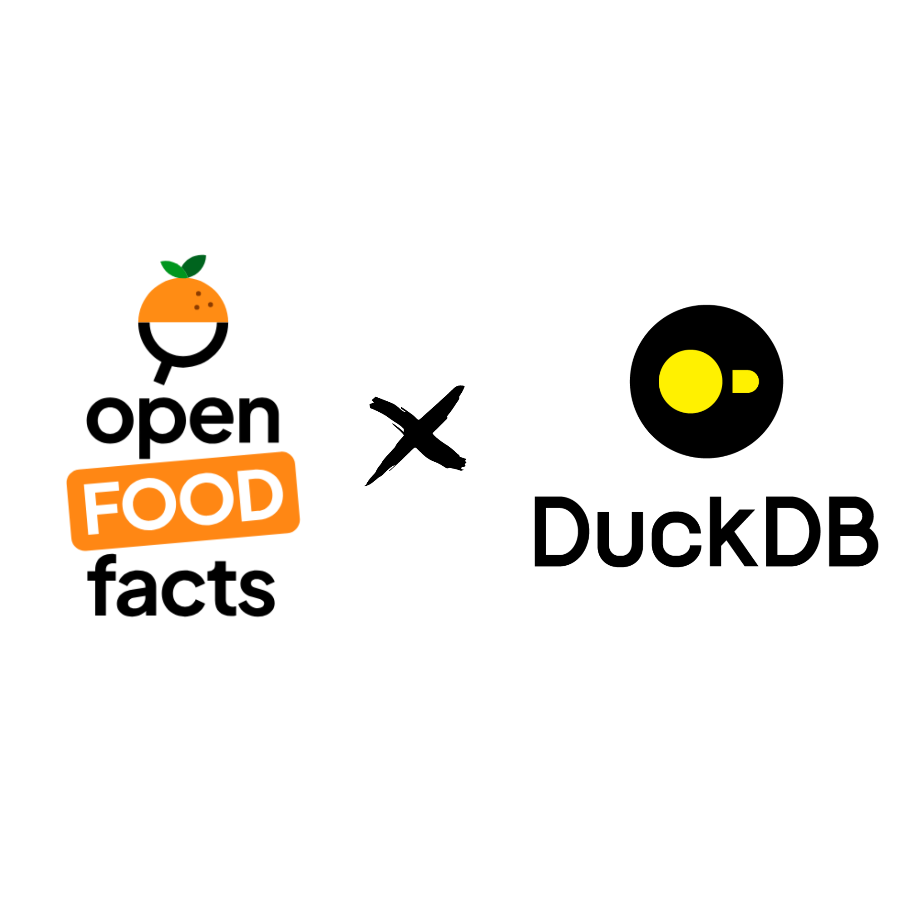

# Food Transparency in the Palm of Your Hand: Explore the Largest Open Food Database using DuckDB :duck:X:orange:

What if I told you that you could access any information about the food industry at your fingertips? For free? A database containing products from all over the world, completely open access?

This database exists and is provided by [**Open Food Facts**](https://world.openfoodfacts.org/discover), a non-profit organization with the mission to make food consumption transparent.

With over 3 million products from various countries, this database includes detailed information about ingredients composition, nutri-scores, allergens, and more. It is updated daily and provided in JSONL or CSV format.

However, since this database is large (10GB to 43GB depending on the amount of information), manipulating the data proved to be a challenging task without the right infrastructure of tools...

*Quack, Quack,*

Enter [**DuckDB**](https://duckdb.org/), an in-process analytical tool designed to process data blazingly fast using an enhanced SQL language!

In this article, we will walk you through exploring and exploiting the Open Food Facts database using DuckDB for your usage.



## Open Food Facts: The Largest Open Food Database in the World

**Open Food Facts** is an open-source project dedicated to providing consumers with total transparency over food products. This database is composed of over 3 million products from various countries, making it the largest open product database in the world.

The Open Food Facts database has been instrumental in the success of today's projects such as [Yuka](https://yuka.io/en/) or [Foodvisor](https://www.foodvisor.io/en/). You, too, can access this open database directly from the Open Food Facts [website](https://world.openfoodfacts.org/data) in various formats, such as JSONL, CSV, or MongoDB dump.

However, even though accessing the data is easy, interacting with it requires computational ressources and technical skills. To this day, the JSONL file alone takes up 43GB of memory once decompressed, making it challenging to exploit.

Luckily for us, tools to process this large amount of data have been developed over the last few years. One of these tools is **DuckDB**.


## DuckDB: The Fast In-Process Analytical Database

[**DuckDB**](https://duckdb.org/) is an open-source project developed to analyze and process large amounts of data using a feature-rich SQL language. 

For years, [Apache Spark](https://spark.apache.org/) have been the most used tool for handling large-scale datasets. However, its complexity and setup requirements can be seen as *overkill* for mid-sized data (10 to 100GB).

Similarly, **SQL** is one of the oldest and most widely used languages for database communication. Yet, it often needs external database infrastructure such as [PostGreSQL](https://www.postgresql.org/) or [MySQL](https://www.mysql.com/), which can be overly complex for analyzing simpler data formats like Parquet or CSV.

On the opposite, [**Pandas**](https://pandas.pydata.org/) has long been the favorite library for Data Scientists and Data Analysts due to its intuitive syntax and comprehensive documentation. However, when working with large datasets, Pandas can be slow and consume significant amounts of memory during processing.


**DuckDB** strikes a perfect balance between these two approaches:

* An enhanced SQL language for efficient querying of large datasets.
* An optimized memory usage to process vast amounts of data quickly.

Let's dive into DuckDB to explore and leverage the Open Food Facts database.

## Installation

You can find the installation guide in the [DuckDB official documentation](https://duckdb.org/docs/installation/). It supports several languages such as Python, Rust, or Javascript.

But in this guide, we will use the best tool to leverage the power of DuckDB: the **Command Line Interface (CLI)**. 

If you're on Windows, the best way to get linux without formating your entire computer is to set up WSL2. (Here's a [guide](https://medium.com/@jeremyarancio/using-linux-under-windows-for-your-data-science-projects-an-installation-guide-of-wsl-9e67bc2b0e4b?sk=0de52d9de03b0785bddf4ba0d38914b5) to help you set it up)

Download the latest version of DuckDB binaries using the following command (update the link with the latest versions):

```bash
sudo wget https://github.com/duckdb/duckdb/releases/download/v1.0.0/duckdb_cli-linux-amd64.zip &&\
unzip duckdb_cli-linux-amd64.zip &&\
mv duckdb /usr/local/bin
```

Type  `duckdb --version` to check if DuckDB was correctly installed:

```bash
duckdb --version
v1.0.0 1f98600c2c
```

You are now set up to play with the Open Food Facts database :orange:.

## Explore the Open Food Facts data

We first download the database from the Open Food Facts [website](https://world.openfoodfacts.org/data).
On this page, you can download several types of data format, such as the MongoDB dump, CSV, or JSONL.

For this use case, we will use the JSONL file since it posseses more information than the CSV file. But it is big: ~7GB compressed, and over 43GB once decompressed!

```bash
wget https://static.openfoodfacts.org/data/openfoodfacts-products.jsonl.gz
```

Once downloaded, we can start using DuckDB to explore its content.

> *"Wait, we don't decompress the file first?"*

Under the hood, DuckDB automatically recognizes the file as compressed in a `.gz` format and decompresses it for us, enabling us to save memory and time. 

Let's start the DuckDB CLI by creating a database where all the tables from our analysis will be stored. 

```bash
duckdb off.db
```

DuckDB creates a custom database `off.db` that compacts the data in a columnar storage type as the Parquet format does, which makes column queries fast. Additionally, data stored in the database takes less memory than there file format equivalent (CSV, JSON, etc ...).

Let's have a look at the Open Food Facts data using the `DESCRIBE` command:

```sql
.timer on --Activate the timer
DESCRIBE (SELECT * FROM read_ndjson('openfoodfacts-products.jsonl.gz', ignore_errors=True)) --ignore_errors is necessary since some elements in the data are in the wrong format
```

```
┌───────────────────────────────────────────┬─────────────┬─────────┬─────────┬─────────┬─────────┐
│                column_name                │ column_type │  null   │   key   │ default │  extra  │
│                  varchar                  │   varchar   │ varchar │ varchar │ varchar │ varchar │
├───────────────────────────────────────────┼─────────────┼─────────┼─────────┼─────────┼─────────┤
│ _id                                       │ VARCHAR     │ YES     │         │         │         │
│ other_nutritional_substances_prev_tags    │ VARCHAR[]   │ YES     │         │         │         │
│ last_edit_dates_tags                      │ VARCHAR[]   │ YES     │         │         │         │
│ last_editor                               │ VARCHAR     │ YES     │         │         │         │
│ nova_group_debug                          │ VARCHAR     │ YES     │         │         │         │
│ ingredients_text                          │ VARCHAR     │ YES     │         │         │         │
│ traces_from_ingredients                   │ VARCHAR     │ YES     │         │         │         │
│ editors_tags                              │ VARCHAR[]   │ YES     │         │         │         │
│ informers_tags                            │ VARCHAR[]   │ YES     │         │         │         │
│ pnns_groups_1_tags                        │ VARCHAR[]   │ YES     │         │         │         │
│ additives_debug_tags                      │ VARCHAR[]   │ YES     │         │         │         │
│ nutriscore_grade                          │ VARCHAR     │ YES     │         │         │         │
│ packagings_materials                      │ JSON        │ YES     │         │         │         │
│ nutrition_data_per                        │ VARCHAR     │ YES     │         │         │         │
│ packaging_recycling_tags                  │ VARCHAR[]   │ YES     │         │         │         │
│ data_quality_info_tags                    │ VARCHAR[]   │ YES     │         │         │         │
│ traces_hierarchy                          │ VARCHAR[]   │ YES     │         │         │         │
│ states_hierarchy                          │ VARCHAR[]   │ YES     │         │         │         │
│ additives_original_tags                   │ VARCHAR[]   │ YES     │         │         │         │
│ minerals_prev_tags                        │ VARCHAR[]   │ YES     │         │         │         │
│         ·                                 │    ·        │  ·      │    ·    │    ·    │    ·    │
│         ·                                 │    ·        │  ·      │    ·    │    ·    │    ·    │
│         ·                                 │    ·        │  ·      │    ·    │    ·    │    ·    │
│ ingredients_text_en_ocr_1580151419_result │ VARCHAR     │ YES     │         │         │         │
│ ingredients_text_en_ocr_1580151419        │ VARCHAR     │ YES     │         │         │         │
│ ingredients_text_en_ocr_1544855786_result │ VARCHAR     │ YES     │         │         │         │
│ ingredients_text_en_ocr_1544855786        │ VARCHAR     │ YES     │         │         │         │
│ ingredients_text_en_ocr_1562578542        │ VARCHAR     │ YES     │         │         │         │
│ ingredients_text_en_ocr_1562578542_result │ VARCHAR     │ YES     │         │         │         │
│ ingredients_text_en_ocr_1563189139_result │ VARCHAR     │ YES     │         │         │         │
│ ingredients_text_en_ocr_1563189139        │ VARCHAR     │ YES     │         │         │         │
│ ingredients_text_en_ocr_1547074706_result │ VARCHAR     │ YES     │         │         │         │
│ ingredients_text_en_ocr_1547074706        │ VARCHAR     │ YES     │         │         │         │
│ ingredients_text_en_ocr_1562841907_result │ VARCHAR     │ YES     │         │         │         │
│ ingredients_text_en_ocr_1562841907        │ VARCHAR     │ YES     │         │         │         │
│ ingredients_text_en_ocr_1653660842_result │ VARCHAR     │ YES     │         │         │         │
│ ingredients_text_en_ocr_1653660842        │ VARCHAR     │ YES     │         │         │         │
│ ingredients_text_en_ocr_1582747034_result │ VARCHAR     │ YES     │         │         │         │
│ ingredients_text_en_ocr_1582747034        │ VARCHAR     │ YES     │         │         │         │
│ ingredients_text_en_ocr_1563072801        │ VARCHAR     │ YES     │         │         │         │
│ ingredients_text_en_ocr_1563072801_result │ VARCHAR     │ YES     │         │         │         │
│ ingredients_text_en_ocr_1562124853_result │ VARCHAR     │ YES     │         │         │         │
│ ingredients_text_en_ocr_1562124853        │ VARCHAR     │ YES     │         │         │         │
├───────────────────────────────────────────┴─────────────┴─────────┴─────────┴─────────┴─────────┤
│ 1031 rows (40 shown)                                                                  6 columns │
└─────────────────────────────────────────────────────────────────────────────────────────────────┘
Run Time (s): real 16.220 user 8.963006 sys 5.099856
```

Let's walk trough this command to understand what happened:

* `SELECT * FROM <table>` is the typical way in SQL to output the entire table. In DuckDB, you can also do the same action by just using `FROM <table>`
* `read_ndjson('openfoodfacts-products.jsonl.gz')` is a function provided by DuckDB to read a JSONL file. As you can see, there's no need to decompress the file manually—DuckDB handles it for us! Depending on the file type, you can also use `read_csv()` or `read_parquet()`.

In addition, we can count the number of products stored in the database:

```sql
SELECT count(*) from read_ndjson('openfoodfacts-products.jsonl.gz', ignore_errors=True);
```

```
┌─────────────┐
│ count(code) │
│    int64    │
├─────────────┤
│     3185774 │
└─────────────┘
```

This means the dataset contains over 3 billions elements!

However, not every feature is relevant for our analysis; many are actually legacy. We only need a few key features. Since DuckDB is optimized for columnar queries, it is perfect for selecting specific features from this massive dataset.

Let's examine a single product to get an idea of what the data looks like.

> You can custom the output visual using `.mode <option>` and `.maxrows <n>`. This is particularly useful if the data doesn't fit in tables. Use .help mode to see the available options.

```sql
.mode lines --Configure outputs to be printed as lines instead of box
FROM read_ndjson('openfoodfacts-products.jsonl.gz') OFFSET 10000 LIMIT 1; --Drop the first 10000 lines and output only one
```

```
_id = 0011233077226
other_nutritional_substances_prev_tags =
last_edit_dates_tags = [2023-01-04, 2023-01, 2023]
last_editor = kiliweb
nova_group_debug =
ingredients_text = Wheat flour*, corn syrup, vegetable oil (palm and/or soybean), sugar, water, pecans*, whole eggs*, contains less than 2% of the following: food starch - modified, butter*, salt, dextrin, maltodextrin, natural and artificial flavor, potassium sorbate and sodium propionate (preservatives), nonfat milk*, whey (milk)*, dextrose, rice syrup, citric acid, ascorbic acid, soy lecithin*, l-cysteine enzymes.
traces_from_ingredients =
informers_tags = [usda-ndb-import, clockwerx, org-database-usda, kiliweb]
pnns_groups_1_tags = [composite-foods, known]
additives_debug_tags = [en-e322i-added, en-e300-removed]
nutriscore_grade = e
packagings_materials = {}
nutrition_data_per = 100g
packaging_recycling_tags = []
data_quality_info_tags = [en:no-packaging-data, en:ingredients-percent-analysis-ok, en:ecoscore-extended-data-not-computed, en:food-groups-1-known, en:food-groups-2-known, en:food-groups-3-unknown]
traces_hierarchy = []
states_hierarchy = [en:to-be-completed, en:nutrition-facts-completed, en:ingredients-completed, en:expiration-date-to-be-completed, en:packaging-code-to-be-completed, en:characteristics-to-be-completed, en:origins-to-be-completed, en:categories-completed, en:brands-to-be-completed, en:packaging-to-be-completed, en:quantity-to-be-completed, en:product-name-completed, en:photos-to-be-validated, en:packaging-photo-to-be-selected, en:nutrition-photo-to-be-selected, en:ingredients-photo-to-be-selected, en:front-photo-selected, en:photos-uploaded]
additives_original_tags = [en:e1400, en:e202, en:e281, en:e330, en:e322i]
minerals_prev_tags = []
ecoscore_grade = unknown
data_quality_tags = [en:no-packaging-data, en:ingredients-percent-analysis-ok, en:ecoscore-extended-data-not-computed, en:food-groups-1-known, en:food-groups-2-known, en:food-groups-3-unknown, en:serving-quantity-defined-but-quantity-undefined, en:ecoscore-origins-of-ingredients-origins-are-100-percent-unknown, en:ecoscore-packaging-packaging-data-missing, en:ecoscore-production-system-no-label]
traces =
amino_acids_prev_tags = []
...
```

Now that we've introduced **DuckDB** and explored the structure of the **Open Food Facts** database, it's time to dive into some analysis.

### What are the most predominant languages?

First, since we don't need the entire dataset for our analysis, we can segment our exploration by creating tables in the DuckDB database. This will allow us to persist our work and make any future queries faster and more efficient than querying the entire dataset each time.

Let's start by creating a table for our analysis. Here's how we can do it:

```sql
CREATE TABLE lang_product AS 
SELECT lang, code, product_name FROM read_ndjson('openfoodfacts-products.jsonl.gz', ignore_errors=True) 
WHERE code IS NOT NULL;  
```

We can show the list of tables using `.tables`. In addition to being lightweight, the table is optimized for SQL queries.

Once the table is created, we can start querying the data to find out which languages are most predominant.

```sql
SELECT lang, count() AS count 
FROM lang_product GROUP BY lang ORDER BY count 
DESC LIMIT 20;               
```

```
┌─────────┬─────────┐
│  lang   │  count  │
│ varchar │  int64  │
├─────────┼─────────┤
│ fr      │ 1209122 │
│ en      │ 1068194 │
│ es      │  319308 │
│ it      │  225794 │
│ de      │  220944 │
│ pt      │   20032 │
│ nl      │   19696 │
│ ru      │   15675 │
│ pl      │   11395 │
│ ro      │   10730 │
│ bg      │    6506 │
│ cs      │    6358 │
│ sv      │    5547 │
│ th      │    4315 │
│ ar      │    4260 │
│ fi      │    4048 │
│ nb      │    4026 │
│ lt      │    3614 │
│ hu      │    2994 │
│ hr      │    2418 │
├─────────┴─────────┤
│      20 rows      │
└───────────────────┘
Run Time (s): real 0.040 user 0.112340 sys 0.035817
```

### List products containing specific ingredients

To retrieve all products containing a specific ingredient, we can first create a table containing a subset of the database relevant to your task:

```sql
CREATE TABLE products AS
SELECT code, product_name, ingredients_text, lang FROM read_ndjson('openfoodfacts-products.jsonl.gz', ignore_errors=True)
WHERE product_name IS NOT NULL AND ingredients_text IS NOT NULL;
```

Next, to list all products containing the ingredient "snail," you can use [pattern matching](https://duckdb.org/docs/sql/functions/pattern_matching) in DuckDB. This allows you to perform case-insensitive searches within the ingredients_text column.

```sql
FROM products
WHERE ingredients_text ILIKE '%snail%'; -- % matches any sequence of zero or more characters - ILIKE is case insensitive
```

This query will return all products that mention "snail" in their ingredients list.

```
┌───────────────┬──────────────────────┬───────────────────────────────────────────────────────────────────────────────────────────┬─────────┐
┌───────────────┬──────────────────────┬───────────────────────────────────────────────────────────────────────────────────────────┬─────────┐
│     code      │     product_name     │                                     ingredients_text                                      │  lang   │
│    varchar    │       varchar        │                                          varchar                                          │ varchar │
├───────────────┼──────────────────────┼───────────────────────────────────────────────────────────────────────────────────────────┼─────────┤
│ 0041224260146 │ Escargots snails     │ Snails water, salt, pepper, laurel, cloves, citric acid.                                  │ en      │
│ 0041224263048 │ Escargot Snails      │ Snails, water, salt, pepper, laurel, cloves, citric acid                                  │ en      │
│ 0070670007821 │ Precooked helix sn…  │ Snails, water, salt, spices and natural flavors.                                          │ en      │
│ 3111950425700 │ Sabarot, Helix Luc…  │ Snail helix iucorum, water                                                                │ en      │
│ 3459860004807 │ Mousse de volaille…  │ t) Mousse de votaitte à rorientate — tngrédients : snailk', riz. To), stabilkants : et …  │ fr      │
│ 8801114305515 │ Snail Bean Paste S…  │ Fermented soybean paste, water, fermented soybean lump, snail, garlic, tuna seasoning, …  │ en      │
│ 0055415700502 │ Escargots            │ SNAILS, WATER, SALT, SPICES\r\nINGREDIENTS: ESCARGOTS, EAU, SEL, EPICES  \r\nFOR NUTRIT…  │ fr      │
│ 0060897015402 │ escargots            │ SNAILS, WATER, SALT, SPICES. \nescargots,EAU, SEL EPICES.                                 │ fr      │
│ 0208167602994 │ Danish snails        │ since 1929 hays market family owned , operated for 4 genepations 201 johnstown center d…  │ en      │
│ 3261089925104 │ Escargots with gar…  │ Snails, butter (milk), garlic, parsley, shallot, salt, pepper, spices, celery.            │ en      │
│ 8809479166499 │ Snail essence mask   │ ne face to let tne remaining essence absorb, [ngredents] water, glycerin, methylpropane…  │ en      │
│ 8809279621358 │ Foodaholic snail m…  │ waler,glycerinpropylene glycolalcoholpeg-60 hydrogenated castor ophenoxy ethanolmethyl …  │ en      │
│ 6970006620769 │ Liuzhou Snail Rice…  │ mixed dried rice noodles bag:(rice, corn starch, drinking water, rice:corn starch3d55:4…  │ en      │
│ 0667888056019 │ Snails               │ Snails, Water, Salt, Spices.                                                              │ en      │
│ 4820219341369 │ Bob                  │ Склад: Начинка (77 %): яблука 61,6 %, полуниці (Харчова (пот 15,4 %, Молочний шоколад (…  │ uk      │
│ 4045198900141 │ Apfelschnecken (ro…  │ Apfelschneckenfleisch (Pila polita). Aus Binnenfischerei in: Mekong, Vietnam, Schleppne…  │ de      │
│ 4820219341352 │                      │ ДЛЯ ПРИГОТУВАННЯ СМАЧНЮЩОТ ЦУКЕРКИ ЛИШЕ ФРУКТИ ТА СПРАВЖНІЙ БЕЛЬГІЙСІ ДОДАНИЙ ЦУКОР? - …  │ en      │
│ 3800236030416 │ wow bust             │ ولره ¿cose wow coo excel ingredients (inci): aqua, snail secretion filtrate, glycerin, …  │ en      │
│ 4820219344278 │                      │ BOB SNAIL ŚLIMAK BOB Podczas produkcji ani jeden ślimak nie został skrzywdzony, skrzywd…  │ de      │
├───────────────┴──────────────────────┴───────────────────────────────────────────────────────────────────────────────────────────┴─────────┤
│ 19 rows                                                                                                                          4 columns │
└────────────────────────────────────────────────────────────────────────────────────────────────────────────────────────────────────────────┘
Run Time (s): real 0.774 user 2.786429 sys 0.000849
```

## Conclusions

**DuckDB** is a powerful tool that empowers users to exploit and analyze large amounts of data swiftly and efficiently, all without the need for complex infrastructure. Rapidly evolving with strong community support, DuckDB is becoming a go-to solution for data analysis tasks.

Coupled with the Open Food Facts database, you gain access to a vast catalog of products that can be leveraged for various projects.

Food transparency is the palm of your hand. :duck::orange:

## How to contribute to Open Food Facts?

Since Open Food Facts is a collaborative project, and you too can contribute to enhancing food transparency worldwide.

You can either:

* Contribute to the Open Food Facts [GitHub](https://github.com/openfoodfacts): explore open issues that align with your skills,
* Download the Open Food Facts [mobile app](https://world.openfoodfacts.org/open-food-facts-mobile-app?utm_source=off&utf_medium=web&utm_campaign=search_and_links_promo_en): add new products to the database or improve exsiting ones by simply scanning their barcodes,
* Join the Open Food Facts [Slack](https://slack.openfoodfacts.org/) and start discussing with other contributors in the OFF community.
 
We can't wait to see you join the community!
