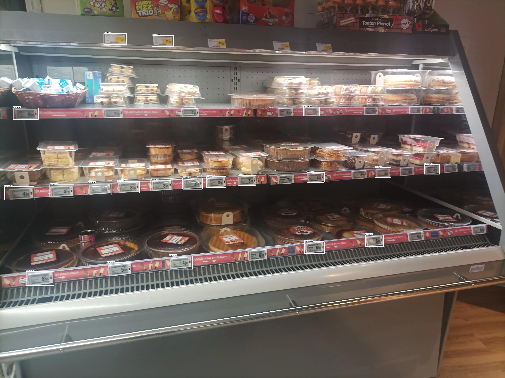
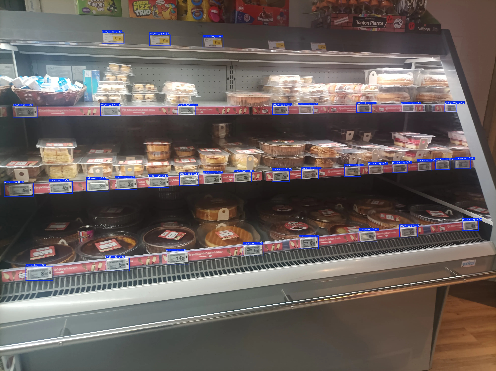
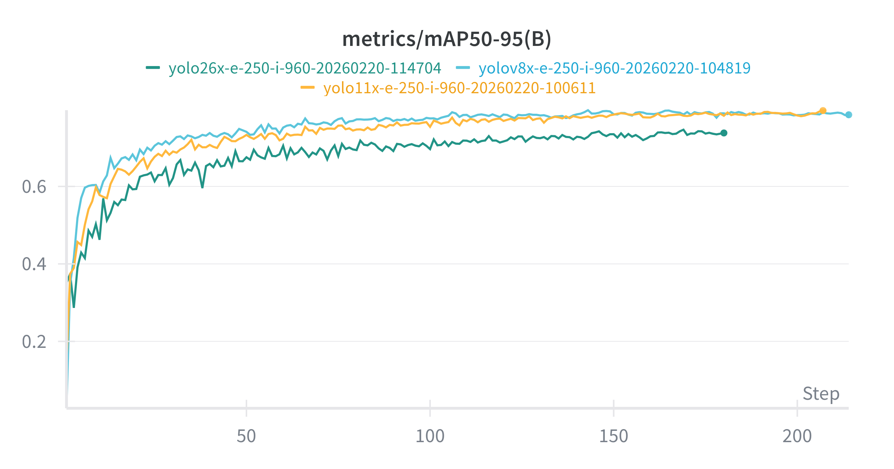

# Price tag detection

This report outlines the methodology and results of improving the object detector model we currently have to detect price tags from images of supermarket shelves, as part of the NLnet NGI0 project.

We build upon the previous work done on price tag detection, and try to improve the model performance by using a larger and more diverse dataset.

The Label Studio project used to annotate the data can be found [here](https://annotate.openfoodfacts.org/projects/56/data).

## 2026-02-03

Project ID was set globally with `uv run labelr config label_studio_project_id 56`.

I first cleaned the dataset by removing duplicate tasks, and tasks with broken image URLs:

```bash
uv run labelr ls check-dataset --delete-duplicate-images --delete-missing-images
```

Then, I pre-annotated all images with the model currently in production.

We first download the model checkpoint with `wget https://huggingface.co/openfoodfacts/price-tag-detection/resolve/main/weights/best.pt -O model.pt`

Then, I added predictions to all tasks:

```bash
labelr ls prediction add --backend ultralytics --model model.pt --labels 'price-tag' --model-version price-tag-detection-prod-imsz-960-threshold-0.1 --threshold 0.1 --imgsz 960 --no-error-raise
```

I noticed that predictions added to the project using the ultralytics library (generated by the command above) are different from predictions coming Robotoff API on some images. Some bounding boxes are missing when using the API (which uses under the hood Triton with a custom preprocessing/postprocessing pipeline).

For example, for [this image](https://prices.openfoodfacts.org/img/0009/HcYxr7g79z.webp), the API prediction is the following:



while the prediction using the yolo CLI (using the same ONNX export) is the following:



After some investigation, the issue came from a bug in how we used the NMSBoxes function provided by openCV: the bounding boxes were not in the right format.
I fixed the issue in [this PR](https://github.com/openfoodfacts/openfoodfacts-python/pull/417). There was another bug in how we called the bounding box visualization function (which powers the predict API): only 20 bounding boxes were displayed, and all bounding boxes with a confidence score below 0.5 were filtered out.

I integrated both fixes in Robotoff in [this PR](https://github.com/openfoodfacts/robotoff/pull/1841) and Open Prices backend ([PR](https://github.com/openfoodfacts/open-prices/pull/1214)).

I also noticed that when pre-annotating with threshold of 0.1 (compared to 0.25 in production), there are few false positives, while detecting more true positive price tags.
Consequently, I decreased the threshold to 0.1 in production ([PR](https://github.com/openfoodfacts/open-prices/pull/1216)).

I then decided to focus the annotation efforts on images that have detected price tags with low confidence, as these are where the model struggle the most (and some are indeed false positive).

To do so, I created a new `labelr prediction show-uncertain` command that output all task IDs for which the prediction have at least one object with a score below `threshold`.
I run it on all tasks:
```bash
uv run labelr ls prediction show-uncertain --model-version price-tag-detection-prod-imsz-960-threshold-0.1 --threshold 0.5 --add-score --output - | sort -t, -k 2,2 > uncertain_ids.csv
```

## 2026-02-04 - 2026-02-17

I wanted annotated more data, using the model prediction to speed up annotation, by focusing on tasks with uncertain prediction (as explained above).

```bash
LANG="en_US.UTF-8" awk -F, '$2 < 0.2 && $2 >= 0.1 {print $1}' uncertain_ids.csv > task_ids.txt
```

The LANG environment variable is required [for proper float comparison with awk](https://stackoverflow.com/questions/41180548/float-comparison-in-awk-and-mawk), as I'm using a french locale.

Then, I add a tag to all these tasks:
```bash
labelr ls tag add --tag 'prediction:score:0.1-0.2' --task-id-file task_ids.txt
```

We can now easily filter these tasks on the Label Studio interface, by creating a new view (tab) with a filter `tags contains 'prediction:score:0.1-0.2'`.
I then annotated ~100 of these tasks. 

## 2026-02-18

I [asked the Open Prices community](https://wiki.openfoodfacts.org/Project:Open-Prices/Price_Tag_Extraction_Improvements) to share URLs of proof images where the price tag detection was not correct, all submitted URLs are saved [in this spreasheet](https://cryptpad.fr/sheet/#/2/sheet/view/wo5TTFLdjJhpl7iGpRYgRc7gN0UApCjvrBIh6gufidM/).

To import them:
1. first, from a `proof_id.txt` text file containing proof IDs, I generated the corresponding API URLs to fetch information about the proof: 
```bash
cat proof_ids.txt | awk '{print "https://prices.openfoodfacts.org/api/v1/proofs/" $0}' > api_urls.txt
```
2. Generate the data to import: 
```bash
for url in $(cat api_urls.txt);
http $url | jq -c '{image_id: .id, image_url: "https://prices.openfoodfacts.org/img/\(.file_path)"}' >> image_import.jsonl;
end
```
3. Import the data:
```bash
labelr ls import-data --dataset-path image_import.jsonl
```
4. Pre-label the data again, selecting all new uploaded tasks in a view with ID `VIEW_ID` (for faster processing):
```bash
labelr ls prediction add --backend ultralytics --model model.pt --labels 'price-tag' --model-version price-tag-detection-prod-imsz-960-threshold-0.1 --threshold 0.1 --imgsz 960 --view-id VIEW_ID
```
5. Add a split, keeping 50% of samples for validation:
```bash
labelr ls add-split --train-split 0.5 --view-id 144
```

#### Import more US data

Detection of price tags in the US are suboptimal, so I added proof images from the US to improve the performance.
##### Category

First, we select from the PostgreSQL DB the proof IDs and the associated image URLs for all US proofs that have at least one price of type `CATEGORY`:
```sql
SELECT
  id, 'https://prices.openfoodfacts.org/img/' || file_path as url 
FROM
  proofs as t1
WHERE
  id IN (
    SELECT
      proof_id
    FROM
      prices as t2
    JOIN locations as t3 ON t2.location_id = t3.id 
    WHERE
    t2.type = 'CATEGORY'
    AND t3.osm_address_country_code = 'US'
    GROUP BY
      t2.proof_id
    HAVING
      count(t2.id) > 1
  )
  AND t1.type = 'PRICE_TAG'
ORDER BY
  id DESC;
```

With fish shell:
```bash
mkdir -p us_category
while read -l line
    # Split the line on the comma – fish returns a list
    set fields (string split ',' $line)

    # The first field is the image id, the second is the URL
    set image_id  $fields[1]
    set image_url $fields[2]

    # Download the image, naming it <id>.webp inside the folder
    wget $image_url -O us_category/$image_id.webp
end < us_category.csv
```

Then run `yolo` with the production model on the full directory, with a confidence threshold of 0.1 (same as production):

```bash
yolo detect predict conf=0.1 model=model.pt source=us_category name=price_tag_us_category
```
#### Product
Same SQL query as above, but with the following changes:
- only keep prices of type `PRODUCT` (instead of `CATEGORY`)
- add an `ORDER random()` and limit to 200 items,  as we have far more product proofs.
```sql
SELECT
  id, 'https://prices.openfoodfacts.org/img/' || file_path as url 
FROM
  proofs as t1
WHERE
  id IN (
    SELECT
      proof_id
    FROM
      prices as t2
    JOIN locations as t3 ON t2.location_id = t3.id 
    WHERE
    t2.type = 'PRODUCT'
    AND t3.osm_address_country_code = 'US'
    GROUP BY
      t2.proof_id
    HAVING
      count(t2.id) > 1
  )
  AND t1.type = 'PRICE_TAG'
ORDER BY
  random()
LIMIT 200;
```

I run the same commands as above.

I also normalized the `image_id` field of all tasks in Label Studio to ensure it was always the `proof_id` (for consistency). The `image_id`s of previous samples were a sub-string of the image URL, which made it difficult to know the ID of the proof. 
### 2026-02-19
I annotated ~100 samples of proofs in the US. I wanted to see whether the model was significantly better by training a new model based on this refined dataset. I first exported the dataset:

```bash
labelr datasets export --from ls --to hf --repo-id openfoodfacts/price-tag-detection --view-id 112 --image-max-size 1500 --label-names price-tag --skip-labels product
```

I tagged the dataset as v1.1 with:

```bash
hf repo tag create openfoodfacts/price-tag-detection v1.1 --repo-type dataset --revision e71a5b765a5a7d4f47992906669378f2f2625567
```

Image max size is higher than on the previous export (=1024), in case we want to see the impact on metrics of larger images.

I then launched a training run with similar hyperparameters as the model we have in production: 250 epochs, max image size of 960px, with yolo11x:

```bash
labelr train train-object-detection \
--wandb-project price-tag-detection \
--wandb-api-key WANDB_API_KEY \
--hf-token HF_TOKEN \
--run-name yolo11x-e-250-i-960 \
--epochs 250 \
--imgsz 960 \
--model-name yolo11x.pt \
--hf-repo-id openfoodfacts/price-tag-detection \
--hf-trained-model-repo-id openfoodfacts/price-tag-detection \
--batch -1 \
--memory-mib 24000
```

I increased in labelr code default shared memory size to 4096mb, as an error occured due to limited shared memory ([commit](https://github.com/openfoodfacts/labelr/commit/c9e58d7ab6a933a61d638a0f5633271f1acf9f57)).

There was another error during the pre-processing phase in the training run, as some webp images had an alpha channel (and we save images as JPEG files). I made sure in both the export to HF and when pre-processing the images during training that we convert images to RGB ([commit](https://github.com/openfoodfacts/labelr/commit/bfd7d0cf243e37dd4cf64669880ec2907fff13b3)).

I relaunched the job.

To compare with other versions of yolo, I also launched, with the same hyperparameters, runs with the following models:
- `yolov8x`
- `yolo26x`

For all these training runs, the validation set changed, so the metrics are not directly comparable to the model in production.

The training lasted more than 24h, so Google Batch stopped the job and relaunched it..
The model weights were not saved, as these are synced on Hugging Face at the end of the training, but we have the mAP50-95 metric for all runs:



Yolov8x was the best-performer, so I use this model for a new run. This time, I rented a RTX 6000 Ada GPU on Verda, which allowed to increase batch size from 2 (auto-batch size) to 16.
