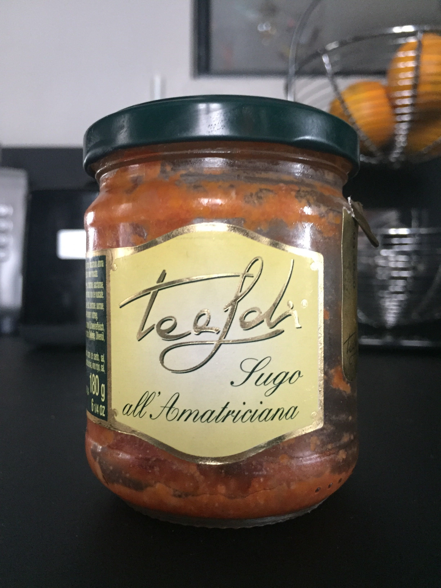
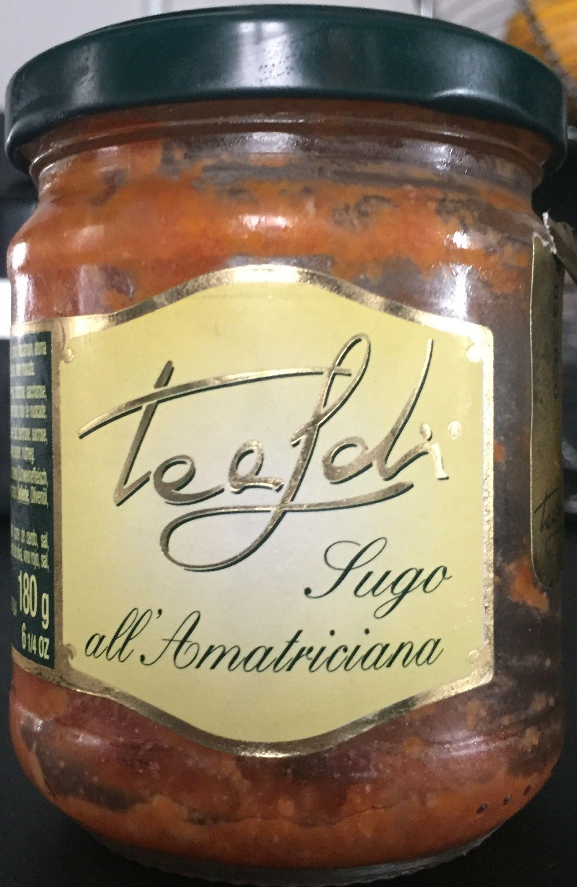

# :lemon: Crop detection :lemon:


When contributors use the mobile app, they are asked to take pictures of the product, then to crop it. But this stage is 
fastidious, especially when contributors need to add several pictures of the same product. 

To assist users during the process, we create a crop-detection model desin to detect the product edges. We fine-tuned **Yolov8n** on images extracted from the Open Food Facts database.


<p align="center">
  
  
</p>

*Product image before and after automatic cropping.*

## Dev
You shall generate a new environment before installing new dependencies. Using Conda:

```bash
conda create -n crop-detection python=3.11
```

Then, prepare your local environment with the following command:

```bash
make init
```

If you just want to load the model, use:

```bash
make load-model
```

This command load the float16.tflite version of the Yolov8n from the [Crop-Detection repository](https://huggingface.co/openfoodfacts/crop-detection) on HuggingFace.


## Run crop-detection

We use Tensorflow Lite to perform the crop-detection inference on image. After `make init`, you can use the CLI to run the model on your computer: 

```bash
python -m cli --help    
```

## Model training

### Data pipeline

To train Yolov8, we extracted product images from the Open Food Facts AWS Bucket. This solution enables us to download a large batch of images without the complexity of using the OFF API, mainly due to the number of requests limit. 

To understand how to reproduce the images extraction, check the Product Opener [documentation](https://openfoodfacts.github.io/openfoodfacts-server/api/aws-images-dataset/), you'll find a code snippet that was actually used to download a batch of images.

However, all images are not equal for our use case. We're seeking for images of products that needs cropping, whereas most of images in the database are already cropped...

Therefore, we filtered the images on 2 criteria:

* The image editor shouldn't be **Yuka**
* We pick images before 2020. 

We used DuckDB coupled with the JSONL dump to filtered codes respecting these 2 criteria. We generate a `.txt` file to store all product barcodes corresponding to our search.

```sql
CREATE TABLE object_detection AS
SELECT code, last_image_dates_tags, correctors_tags 
FROM read_ndjson('openfoodfacts-products.jsonl.gz')
;

COPY(
  SELECT code
    FROM object_detection
    WHERE (last_image_dates_tags[-1]::integer) < '2020'
    AND list_aggregate(correctors_tags, 'string_agg', '|') NOT LIKE '%yuka%'
  ) TO 'best_image_codes.txt' (DELIMITER ' ', HEADER FALSE)
;
```

We then generate the set of images using the command `load_images_from_aws.sh`.

### Annotation on Label-Studio

We used Label-Studio for the annotation. You can find the annotated images at https://annotate.openfoodfacts.org/projects/50/data.

We also pre-annotated the images using [Yolo-World](https://huggingface.co/spaces/stevengrove/YOLO-World), an object detection model using custom labels. 

You'll find the code to pre-annotate, upload and download the data in `ml_utils/ml_utils_cli/cli`.

### Training

The model training was done using the Ultralytics library. Learn more by check the [official documentation](https://docs.ultralytics.com/modes/train/). We used Lightning AI to run the training job using GPUs (L4)

```bash
yolo detect train \                                                                               
 data=data/data.yaml \
 model=models/yolov8n.pt \
 epochs=200 \
 imgsz=640 \
 batch=64
```

### Export to TFLite

To export is as easy as the training with Ultralytics:

```bash
yolo export model=weights/best.pt format=tflite
```

## Links

* Demo: https://huggingface.co/spaces/openfoodfacts/crop-detection
* Model repo: https://huggingface.co/openfoodfacts/crop-detection
* Label Studio: https://annotate.openfoodfacts.org/projects/50/data